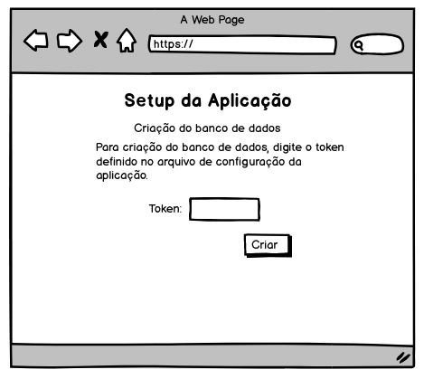
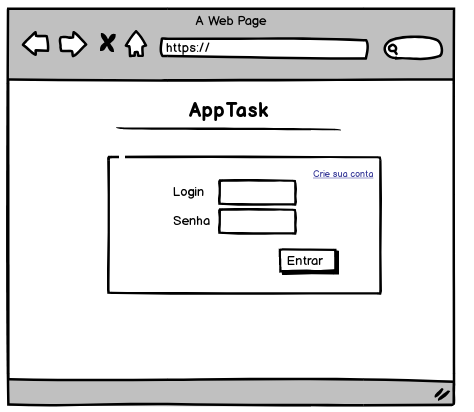
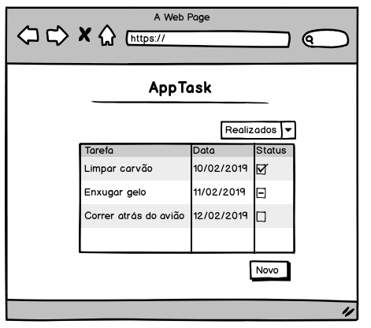

# 1. Episódio - Visão geral do projeto

Vamos começar a nossa jornada com aplicação que será utilizada como base. Vamos desenvolver um aplicativo bem simples que registra as tarefas que devem ser executadas por uma pessoa.

O nome da nossa aplicação é `apptask`.

A prototipação da aplicação é essa:

Na tela1 temos a primeira execução da aplicação. Como previsto não temos um banco de dados, portanto vamos criar através da entrada de um token de segurança.




Com o banco criado, temos a tela de login, se o usuário não existir temos que criar um formulário para o cadastro do usuário. Não crie o prototipo dessa dela para não ficar muitas images.



Com o usuário logado, temos as tarefas. O usuário pode criar novas tarefas, fechar a tarefa com sucesso, fechar com insucesso (não realizou), alterar a data.

Um filtro deve ser criado para o usuário localizar as tarefas fechadas.



O usuário também deve ter a opção de excluir a sua conta e automáticamente todas as tarefas.


Vamos utilizar as seguintes tecnologias para o desenvolvimento:

- *Python*: Linguagem de programação;
- *Flash*: Microframework para desenvolvimento web;
- *sqlalchemy*:Lib de ORM para manipulação de banco de dados.

Aplicação vai rodar em um containner Docker. Portanto vamos utilizar o seguinte `Dockerfile` durante o projeto.

```
FROM ubuntu:latest
LABEL maintainer Clodonil Trigo "clodonil@nisled.org"
RUN apt-get update -y
RUN apt-get install -y python-pip python-dev build-essential
COPY . /apptask
WORKDIR /apptask
RUN pip install -r requirements
ENTRYPOINT ["python"]
CMD ["run.py"]
```
Não se preocupe com o Dockerfile agora, vamos tratar dele em cada episódio.

Finalizamos esse primeiro episódio apenas o projeto, agora vamos entrar em código Hands-on.

[2. Episódio - Database](ep2.md)

