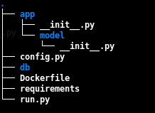
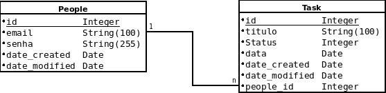

# 2. Episódio - Database

Ao final desse episódio devemos ter um banco de dados criado e estruturado. Para chegarmos esse objetivo, vamos percorrer um curto caminho, mais com bastante informação.

Antes de mais nada, vamos definir a estrutura do nosso projeto. Uma das razões da escolha do `Flash` como framework de desenvolvimento web é porque ele é super flexível com relação a estruturação do projeto e você como programador tem a livre escolha.

Então utilizando essa livre escolha, estruturamos o nosso projeto dessa forma.



No diretório `app` temos todo o código relacionado ao nosso projeto, segue a descrição dos arquivo:

- *`__init__.py`*: É o arquivo principal do projeto, podemos dizer que esse arquivo é o `controller` do projeto.
- *`model/__init__.py`*: Cada diretório dentro da pasta `app` chamamos de módulo e o `model` vai ser o módulo relacionado ao banco de dados. O arquivo `__init__.py` descreve a estrutura do banco de dados.

> Não vamos detalhar linha por linha de programação, deixei o código já documentado, portanto apenas código de fato importante serão detalhados. Caso fique dúvida olhe o código completo.

Os outros arquivos que estão na raiz do projeto, são utilizado para configuração do sistema, vou detalhar cada um deles.

- *`config.py`*: Utilizado para armazenar as variáveis do sistemas. 
- *`Dockerfile`*: Utilizado construir a imagem docker
- *`requirements`*: Arquivo que contém as dependência do nosso sistema;
- *`run.py`*: Utilizado para inicializar aplicação
- *`db`*: Diretório que será armazenado o banco de dados

Agora que temos a nossa estruturação pronta, podemos começar e primeiramente vamos criar a estrutura de diretório e os arquivos conforme descrito.

> Caso não queira criar manualmente os arquivos, basta fazer download ou clonar o [projeto no gitlab](https://github.com/clodonil/apptask/tree/master/ep2). 

```bash
$ touch config.py Dockerfile requirements run.py
$ mkdir -p app/model db
$ touch app/__init__.py app/model/__init__py
```

Vamos começar pelo arquivo principal, que chamado de controller.

- *`app/__init__.py`*

  Arquivo de controller, é o arquivo que orquestra todo o projeto. 

  ```python
    # Importamos as bibliotecas do Flask e do banco de dados o SQLALchemy.
    from flask import Flask
    from flask.ext.sqlalchemy import SQLAlchemy
    
    # Instanciando a biblioteca do Flask e criando o objeto app
    app = Flask(__name__)
    # Importando as variaves de configuracao
    app.config.from_object('config')

    # Instanciando a lib do SQLAlchemy para o projeto app
    db = SQLAlchemy(app)

    # Importando o modulo model (tabelas)
    from app import model
  ```
  O arquivo é bem pequeno e tranquilo de entender, faz basicamente duas coisas, instância os objetos e importa o módulo das tabelas do banco de dados.

- *`app/model/__init__py`*
  
  Esse é o maior arquivo que vamos ter no projeto, portanto ao dominar esse arquivo o restante do projeto vai ser tranquilo.
  Apesar desse arquivo sem grande, é bastante simples. 
  
  Em uma visão geral ele declara duas `class` que serão duas tabelas do banco de dados, em cada `class` declara os atributos que são os registro do banco de dados, conforme mosta a figura abaixo.
  
  
  
  Além dos atributos dos registro da tabela, a classes também declara os métodos que estaremos realizando com essa tabela, tais como adicionar registro, deletar registro, alterar registro.

  Toda a mágina da transformação desse código em tabela no banco de dados fica com conta da lib `SQLAlchemy`.

  ```python
    # Importacao das libs do projeto. A lib db esta sendo importado do arquivo __init__.py do controller.
    from app import db
    from datetime import datetime
    from sqlalchemy.sql.expression import text
    from sqlalchemy.exc import SQLAlchemyError
    import os
    
    # Declaracao da class People, que vai se tornar na tabela People do banco de dados
    class People(db.Model):
          # Definicao dos registro do banco de dados e seus tipo. Perceba os registro que são chave primaria.
          id            = db.Column(db.Integer, primary_key=True)
          email         = db.Column(db.String(100), index=True)
          senha         = db.Column(db.String(255), index=True)          
          date_created  = db.Column(db.DateTime)
          date_modified = db.Column(db.DateTime)

          # Relacionamento com a tabela Task, portanto podemos buscar valores na tabela task utilizando o registro tasks.
          tasks         = db.relationship('Task', backref='people', lazy=True)
    
          # Metodo que vai retornar informacao/label da class (tabela)
          def __repr__(self):
              return '<People %r>' %(self.email)
    
          # Construtor da class, nesse caso, vamos utiliar os registro email e senha para inicializar
          def __init__(self,email, senha):
              self.email          = email
              self.senha          = senha
              self.date_created   = datetime.now()
              self.date_modified  = datetime.now()
    
          # Metodo para adicionar um novo registro
          def add(self,people):
              db.session.add(people)
              return session_commit ()

          # Metodo para alterar um registro 
          def update(self):
              self.date_modified  = datetime.now()
              return session_commit()

          # Metodo para apagar um registro
          def delete(self,people):
              db.session.delete(people)
              return session_commit()
    
    # Declaracao da class Task, que vai se tornar na tabela Task do banco de dados
    class Task(db.Model):
          # Definicao dos registro do banco de dados e seus tipo. Perceba os registro que são chave primaria.
          id            = db.Column(db.Integer, primary_key=True)
          titulo        = db.Column(db.String(100), index=True)
          status        = db.Column(db.Integer)
          data          = db.Column(db.Date) 
          date_created  = db.Column(db.DateTime)
          date_modified = db.Column(db.DateTime)

          # ForeignKey define a chave estrangeira da tabela que vai esta no registro people_id relacionado com a table people.id. Pereceba que é um relacionamento de N para 1.
          people_id     = db.Column(db.Integer, db.ForeignKey('people.id'))
    
          # Metodo que vai retornar informacao/label da class (tabela)  
          def __repr__(self):
              return '<Task %r>' %(self.titulo)
    
          # O construtor da class recebe o titulo da task, a data para realização e o id do usuário. Perceba que outros atributos são atribuidos automaticamente durante a chamado do construtor, tais como status e a data de criação e alteração do registro.
          def __init__(self,titulo,data, people_id):
              #Status
              # 1 - Ativo
              # 2 - Cancelado
              # 3 - Realizado
    
              self.titulo         = titulo
              self.status         = 1  
              self.data           = data
              self.people_id     = people_id        
              self.date_created   = datetime.utcnow()
              self.date_modified  = datetime.utcnow()
    
          # Metodo para adicionar um novo registro    
          def add(self,task):
              db.session.add(task)          
              return session_commit()

          # Metodo para Alterar um registro    
          def update(self):
              self.date_modified  = datetime.now()
              return session_commit()

          # Metodo para apagar um registro    
          def delete(self,task):
              db.session.delete(task)
              return session_commit()
    
    #Universal functions sao chamadas nos metodos para persistir os dados no banco. E de fato um commit.
    
    def  session_commit():
          try:
            db.session.commit()
          except SQLAlchemyError as e:             
             db.session.rollback()
             reason=str(e)
             return reason
    
  ```

- *`config.py`*
  
  O arquivo `config.py` é importado pelo arquivo de controler `app/__init__.py` e nele contém algumas variáveis.


  ```python
    # Importada a biblioteca do os, para trabalhar com diretório
    import os
    
    #As duas variáveis seguintes são recursos de segurança para formulario.
    WTF_CSRF_ENABLED=True
    SECRET_KEY = "you-will-never-guess"
    
    # Define o diretorio base como sendo do projeto. Essa informação é util para criar o banco de         dadosdentro do diretório db.
    basedir = os.path.abspath(os.path.dirname(__file__))
    
    # Define que o diretorio do banco de dados vai ser o db e o nome do banco de dados vai ser         obanco_de_dados.db   
    database = os.path.join(basedir, 'db/banco_de_dados.db')
    SQLALCHEMY_DATABASE_URI = 'sqlite:///' + database
    
    # Nesse projeto nao vamos controlar o versionamento do banco de dado, portanto podemos desligar oTRACK         de modificacao.
    SQLALCHEMY_TRACK_MODIFICATIONS = False
    
    # Esses 3 ultimas variáveis são utilizado pelo arquivo run.py e sao basicamente para definir se odebug         vai estar habilitado, isso é bom para o desenvolvimento. Também define a porta da aplicacao eo IP do         host.
    DEBUG = True
    PORT = 8080
    HOST = "0.0.0.0"
  ```

- *`run.py`*

  O arquivo `run.py` é start da aplicação. É bastante simples.

  ```python
    # Importa o objeto app do arquivo de controle app/__init__.py.
    from app import app
    
    # Executa o aplicativo utilizando como parâmetro os valores definido no arquivo config.py
    app.run(app.config['HOST'],app.conf['PORT'],app.config['DEBUG'])

  ```

- *`requirements`*
  
  Nesse arquivo definimos todas as dependências que o projeto tem. O build da imagem docker utiliza esse arquivo para realizar a instalação.
  ```
   Flask==0.10.1
   Flask-SQLAlchemy==2.3.2
  ```

- *`Dockerfile`*

  E por último temos o Dockerfile para criação da imagem.
  
  ```Dockerfile
  # Vamos utilizar uma imagem base do linux ubuntu
  FROM ubuntu:latest
  
  # Definimos o dono da imagem
  MAINTAINER Clodonil Trigo "clodonil@nisled.org"
  
  # Atualizamos a imagem
  RUN apt-get update -y
  
  # Instalamos o Python
  RUN apt-get install -y python-pip python-dev build-essential
  
  # Copiamos os arquivos do projeto para dentro da pasta apptask do containner.
  COPY . /apptask
  
  # Definimos o diretorio /apptask como o principal
  WORKDIR /apptask
  
  # Instalamos a dependencia do projeto
  RUN pip install -r requirements
  
  # Definimos Python como executor de comando
  ENTRYPOINT ["python"]
  ```
Com tudo criado, podemos agora construir a imagem docker e assim poder validar o que fizemos até aqui.

Realizando o build da image apptask:latest:

```bash
$ docker build -t apptask:latest .
```

Vamos rodar a imagem e realizar algumas testes em nossa aplicação: 

```bash
$ docker run -it apptask
```


Quando executamos a imagem, entramos na linha de comando do python, representando pelo ">>>". Como nossa aplicação não está pronta ainda, vamos testar dessa forma:
Primeiramente vamos importa as bibliotecas da nossa aplicação:

Vamos importar a função `db` que está dentro do arquivo `__init__.pp` dentro da pasta `app`. É necessário importar para poder criar o banco de dados.

```python
>>> from app import db
>>> db.create_all()
```

Agora vamos importar a lib `datetime` para obter a data atual e também vamos importar do arquivo da pasta `app/model/__init__.py` para manipular as tabelas do banco de dados.

```python
>>> import datetime
>>> from app.model import People, Task
```
Com as classes das tabela importadas, vamos criar os registros da tabela `People` e `Task`.

```python
>>> user = People('user1@localhost','x')
>>> user.add(user)

>>> t1 = Task('Atividade 1',now,user.id)
>>> now = datetime.datetime.now()
>>> t1 = Task('Atividade 1',now,user.id)
>>> t1.add(t1)
```

Agora que temos os registros criados, vamos verificar o relacionamento entre as tabelas:

```python
>>> t1.people
<People u'user1@localhost'>
>>> user = People.query.get(1)
>>> user.tasks
[<Task u'Atividade 1'>]
```

Agora que validamos que está tudo certo com o banco de dados, podemos dizer que acabamos o primeiro episódio.

Uffa... tome um café, um suco ou apenas ar e vamos para o próximo.

[3. Episódio - Criando a primeira interface](ep3.md)
