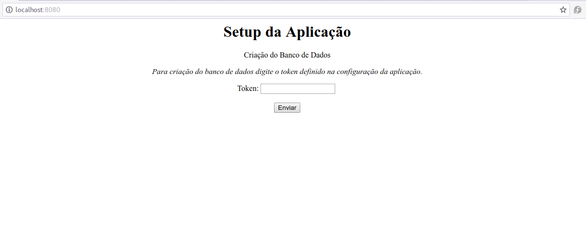
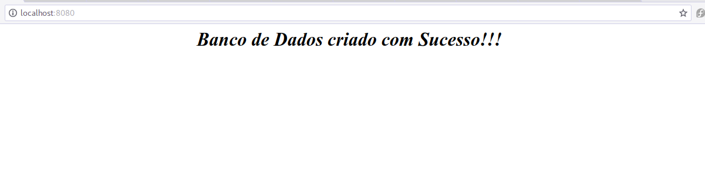

[3. Episódio - Criando a primeira interface](ep3.md)

Nesse e episódio vamos criar a nossa primeira interface. No episódio anterior vimos como criar o banco de dados. 

Só que o nosso banco de dados deve ser criado durante a execução do programa, normalmente quando o aplicativo é executado pela primeira vez. O sistema deve verificar se o banco existe, se não existir ele cria.

Para executarmos essa tarefa com a mínima segurança, vamos definir um token no arquivo `config.py` e na primeira vez que o aplicação é executado, o usuário deve informar o token para criar o banco de dados.

Vamos começar alterando o arquivo [`config.py`](ep3/config.py) adicionado a variável de token com o nome `create_db_token`.

```python
....
....
create_db_token = "macacoloco"
```

O próximo arquivo que vamos alterar é o [`app/__init__.py`](ep3/app/__init__.py). Como o arquivo teve bastante modificação, coloquei o arquivo inteiro. 

Na execução do aplicação, primeiro verifica se o banco de dados existe.

Se não existir, e o método da chamada é [GET](https://blog.alura.com.br/diferencas-entre-get-e-post/), temos a condição perfeita para abrir o formulário `settings.html` para solicitar o token para criação do banco de dados.

Ao preencher o formulário e enviar através do método [POST](https://blog.alura.com.br/diferencas-entre-get-e-post/) para ser verificado o token, se for válido, o banco de dados é criado.

Segue o comentário do código para um melhor entendimento.

```python
import os

#Importamos outros recursos do flash para renderizar templates
from flask import Flask, Blueprint, redirect,url_for,request, render_template
from flask.ext.sqlalchemy import SQLAlchemy

# Importamos as variáveis databsae e create_db_token do arquivo config 
from config import database, create_db_token

app = Flask(__name__)
app.config.from_object('config')

# Banco de Dados
db = SQLAlchemy(app)

# Criacao da rota index(/) da aplicacao que pode aceitar os métodos GET e POST
@app.route('/',methods = ["GET","POST"])
# Metodo que vai implementar a rota index(/)
def index():
    # Verifica se o banco de dados existe, se não existir entra na condicao, olhe o not
    if not os.path.exists(database):

       # Verifica se o método é GET, se for verdade é renderizado o html settings.html que contém o formulário para digitar o token
       if request.method == "GET":
          return render_template('settings.html')    

       # Verifica se o método é POST, se for significa que é o envio do formulário
       elif request.method == "POST":
          # obtem o valor do token digitado no formulário
          get_token = request.form['token']
          
          # Compara se o token digitado é igual ao token armazenado no arquivo config.py 
          if create_db_token == get_token:
             # Se for igual p banco de dados é criado 
             db.create_all()
             # Mensagem de retorno
             return "<center><h1><em>Banco de Dados criado com Sucesso!!!</em></h1></center>"
          else:
             # Caso o token não seja igual, uma mensagem de erro é informado
             return "<center><h1><em>Token invalido, tente novamente!!!</em></h1></center>"
       else:
          return "<center><h1><em>Tela de Login</em></h1></center>"
         

# Modulos
from app import model
```

Agora por último vamos criar o formulário html. Para isso vamos criar um diretório dentro do `app` com o nome `templates` que vai ter as páginas html do nosso projeto.

```bash
$ mkdir app/templates
$ touch app/templates/settings.html
```
O conteúdo do arquivo [`settings.html`](ep3/app/templates/settings.html) é um formulário padrão html.

```html
<html>
    <title>Criando a database</title>
    <body>
        <h1><center> Primeiro Acesso: Criando Banco de Dados  </center></h1>
        <span>
            <form action="" method="post">
                <label> Token: </label>
                <input type="text" name="token">
		<input type="submit">
            </form>
        </span>
    </body>
</html>
```

Fizemos uma alteração básica no arquivo [`Dockerfile`](ep3/Dockerfile) para não entrar diretamente no python, nesse caso vamos precisar de um terminar para ver os logs.


Agora a nossa aplicação já tem uma interface web para a criação do banco de dados. E como definido no arquivo de `config.py` a porta da aplicação é 8080. Portanto ao executar o docker, precisamos externalizar essa porta.

Lembre-se de realiar o build para essa nova imagem:

```bash
$ docker build -t apptask:latest .
```

Para externalizar a porta 8080, utilizamos o parâmetro `-p`. 

```bash
$ docker run -it -p 8080:8080 apptask
```

Agora dentro do container vamos inicializar aplicação e acompanhar o logs.

```bash
python run.py 
 * Running on http://0.0.0.0:8080/ (Press CTRL+C to quit)
 * Restarting with stat
 * Debugger is active!
 * Debugger PIN: 236-035-556
```

Na tela1, é solicitado o token definido no arquivo no arquivo `config.py` na variável `create_db_token`. Futuramente vamos melhorar esse método de geração de token.



E na tela2, temos o banco de dados criado.




Dessa forma finalizamos o episódio 4.

[4. Episódio - Registro de Usuário e Login](ep4.md)


